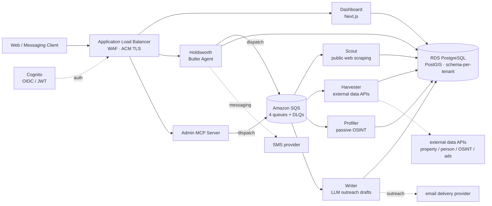

# AI Sales Intelligence Platform

> ⚠️ **Portfolio / Demonstration Repository** — This repo contains infrastructure and architecture patterns from a real multi-tenant SaaS system. All AWS account IDs are placeholders (`000000000000`). CI workflows are intentionally non-executing. Proprietary business logic is excluded.

A multi-tenant SaaS reference architecture for an agentic outbound sales platform: autonomous agents aggregate public-source intent data, build prospect context, and draft personalized outreach, with a conversational "butler" agent as the customer-facing interface. The goal of this repo is to showcase the **infrastructure, multi-tenancy, and CI-CD patterns** that make such a system operable — without exposing the proprietary signal catalog, scoring, or prompt engineering that drive the live product.

---

## Architecture



All services run on ECS Fargate behind a single ALB. Agents consume from per-agent SQS queues (with DLQs and bounded retries), write job results to a shared `job_results` table, and isolate per-customer data in a PostgreSQL schema-per-tenant layout. Authentication is Cognito-issued JWTs validated at every service boundary.

---

## Tech stack

| Layer | Technology |
|---|---|
| Compute | AWS ECS Fargate |
| Load balancing | AWS Application Load Balancer + WAF |
| Database | AWS RDS PostgreSQL + PostGIS |
| Messaging | AWS SQS (per-agent queues + DLQs) |
| Auth | AWS Cognito (OIDC / JWT) |
| Secrets | AWS Secrets Manager |
| Threat detection | AWS GuardDuty |
| Infrastructure as Code | Terraform |
| CI / CD | GitHub Actions |
| Agent runtimes | Node.js 20, Python 3.12 |
| Frontend | Next.js 14 (TypeScript) |
| Containerization | Docker (multi-stage) |
| LLM | Anthropic Claude |

---

## Agents

| Agent | Runtime | Purpose |
|---|---|---|
| Scout | Python 3.12 | Polls public local / municipal web sources for intent signals. |
| Harvester | Python 3.12 | Aggregates structured data from external data APIs (property, person, reviews, ads). |
| Profiler | Python 3.12 | Builds prospect dossiers using passive OSINT techniques only. |
| Writer | Node.js 20 | Generates personalized outreach drafts via the Anthropic API. |
| Holdsworth | Node.js 20 | Customer-facing "butler" — conversational interface over WhatsApp / SMS / email, plus scheduled tasks. |
| Admin MCP Server | Node.js 20 | Internal orchestration surface — exposes operator tools via the Model Context Protocol. |

---

## Repository structure

```
.
├── CLAUDE.md                    # ground rules for AI-assisted development
├── LICENSE                      # MIT
├── README.md                    # this file
├── ARCHITECTURE.md              # redacted architecture reference
├── CONTRIBUTING.md              # contributor guide
├── CHANGELOG.md                 # Keep-a-Changelog
├── docs/
│   ├── DEPLOYMENT.md            # GitOps model (demo — does not deploy)
│   ├── DATABASE.md              # schema-per-tenant pattern + public tables
│   ├── MCP_TOOLS.md             # MCP server tool shapes
│   └── diagrams/
│       └── system-architecture.mermaid
├── terraform/                   # Sprint 1 — modules + environments
│   ├── modules/
│   └── environments/
│       ├── dev/
│       ├── staging/
│       └── prod/
├── agents/                      # Sprint 2/3 — containerized services
│   ├── scout/
│   ├── harvester/
│   ├── profiler/
│   ├── writer/
│   ├── holdsworth/
│   └── admin-mcp/
├── migrations/                  # Sprint 2 — public tables only
└── .github/
    ├── workflows/               # Sprint 1+ — non-executing offline workflows
    └── pull_request_template.md
```

---

## Sprint roadmap

| Sprint | Status | Scope |
|---|---|---|
| **Sprint 0** | ✓ complete | Repository foundation — docs, license, CLAUDE ground rules, CHANGELOG, PR template. |
| Sprint 1 | upcoming | Terraform foundation — VPC / ALB / RDS / SQS / ECS modules, per-env parameterization, offline-only validation workflow. |
| Sprint 2 | upcoming | Agent container infrastructure — Dockerfiles, task definitions, ECS services, public-schema migrations. |
| Sprint 3 | upcoming | Agent scaffolding and Admin MCP server — service skeletons and the MCP tool surface (names and shapes only). |

---

## Build and validate locally

This repo does **not** deploy. All commands below are offline validators.

```bash
# Terraform (once Sprint 1 lands)
terraform -chdir=terraform/environments/dev init -backend=false
terraform fmt -recursive terraform/
terraform validate terraform/environments/dev
tflint --recursive terraform/

# Container lint (once Sprint 2 lands)
hadolint agents/*/Dockerfile
docker build -t demo/scout:local agents/scout/

# App-level (once Sprint 3 lands)
eslint agents/admin-mcp/
ruff check agents/scout/
pytest agents/scout/tests/
```

---

## Author

**Cameron Hensley** · [GitHub](https://github.com/cameronkeithhensley)
